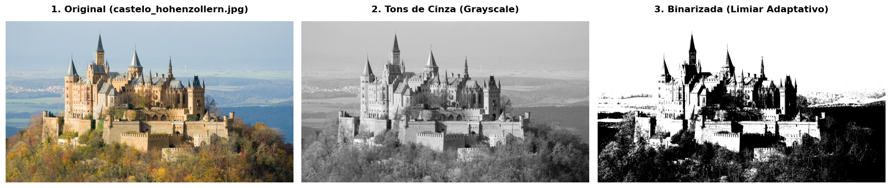

# Redução de Dimensionalidade para Segmentação de Imagens

Este repositório apresenta o desenvolvimento e a análise diagnóstica de um pipeline modular de Processamento Digital de Imagens (PDI) focado na redução de dimensionalidade espacial e cromática. O projeto foi estruturado utilizando princípios de código limpo (*Clean Code*) e funções vetorizadas em **NumPy**, mitigando abordagens lineares/imperativas comuns em scripts acadêmicos para viabilizar um fluxo de engenharia de recursos (*Feature Engineering*) performático e replicável.

**Desafio de Projeto — DIO BairesDev - Machine Learning Practitioner**

---

## 1. Descrição do Problema e Abordagem Técnica

Em modelos de Visão Computacional de larga escala, o processamento direto de matrizes brutas em alta resolução e múltiplos canais de cor gera uma alta sobrecarga computacional (*Maldição da Dimensionalidade*) e insere ruídos indesejados. A redução estruturada do espaço amostral é uma etapa crítica de preparação de dados.

O objetivo deste projeto foi construir um pipeline puramente matemático (sem o uso de frameworks de alto nível como OpenCV) para transformar imagens RGB coloridas em representações binárias (preto e branco) de alto contraste, preservando as características estruturais (bordas, formas e texturas) do objeto principal.

---

## 2. Desafios de Engenharia de Dados Aplicados

* **Volatilidade Espacial e Canal Alpha:** Arquivos de imagem brutos carregam metadados heterogêneos e, frequentemente, quatro canais de cores (RGBA). O pipeline implementa uma normalização na ingestão utilizando a biblioteca PIL, forçando a conversão para o espaço de cores RGB e estruturando os dados em tensores tridimensionais estritos de dimensões $(H \times W \times 3)$.
* **Compressão por Luminosidade (Grayscale):** Para realizar a redução cromática sem distorcer a percepção de profundidade natural da cena, aplicou-se a **Fórmula de Luminosidade (Diretriz ITU-R BT.601)**, ponderando os canais pela sensibilidade do sistema visual humano:
  $$\text{Y} = 0.2989 \cdot R + 0.5870 \cdot G + 0.1140 \cdot B$$
  Esse mapeamento comprime o tensor tridimensional em uma matriz bidimensional de intensidade escalar $(H \times W)$, reduzindo o peso computacional dos dados a um terço do original.
* **Limiarização Dinâmica Adaptativa (Binarização):** Modelos de limiar estático falham sob condições variáveis de iluminação. Para mitigar essa fragilidade, o pipeline calcula um corte adaptativo baseado na média global de intensidade dos pixels ($\mu$), aplicando uma máscara booleana vetorizada extremamente rápida para converter o array em um mapa binário discreto (0 ou 255).

---

## 3. Resultados Diagnósticos

O pipeline foi validado utilizando a imagem do castelo Hohenzollern. Abaixo está o mapeamento visual gerado em cada estágio do fluxo:

* **Imagem Original (RGB):** Tensor tridimensional completo.
* **Tons de Cinza:** Compressão cromática ideal preservando as nuances de sombreamento e contraste.
* **Binarizada:** Isolamento completo da silhueta, relevos e arestas estruturais do castelo em relação ao céu através do limiar adaptativo.

  

